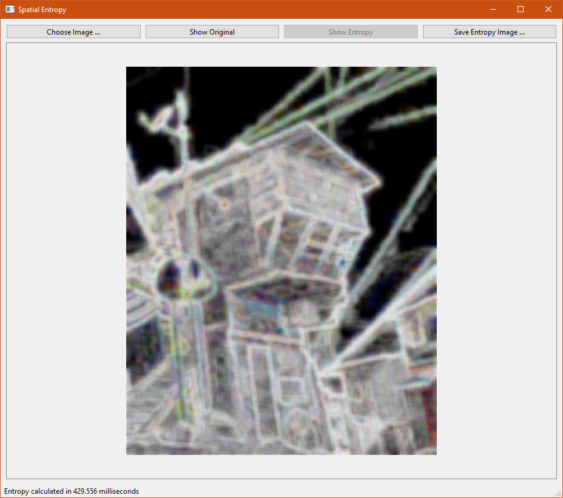

# spatial-entropy-qt

A lazy after-work project to solidify some R&D I was doing earlier this year.
This application calculates something like spatial Shannon entropy as a windowed kernel moving over the image.
It is sort of a measure of regional variability.
Perhaps it is analogous to the theoretical maximum inverse compressibility of an image.
That is, regions which are black are highly compressible, and regions which are light are highly incompressible.

